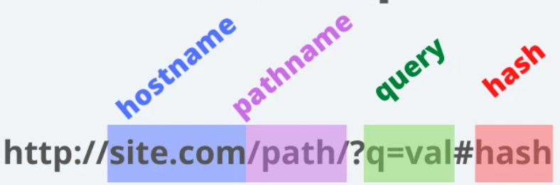

# jPaths
www.jpaths.com

The Synthax that is required to encode an URI is very general. 
There is fixed encoding according to US-ASCII standards

There is also a standard that revers to the referees to the Universal Character Code (Unicode/ISO 10646) where it is possible to also use international symbols., i.e. symbols that are not in the US-ASCII encoding.

    US-ASCII Encoding

    Percent Encoding for reserved characters, or characters that do not exist in US-ASCII encoding and there are reserved characters that have special functions and permitted characters as well as not-permitted characters.

    pct-endoced = "%" HEDIG HEXDIG

    Reserved characters with special function
        reserved = gen-delims / sub-delims
        gen-delimns = ":" / "/" / "?" / "#" / "[" / "]" / "@"
        sub-delimns = "!" / "$" / "'" / "(" / ")" / "+" / "," / ";" / "="

    Permitted characters

    unreserved = ALPHA / DIGIT / "-" / "." / "_" / "~"

    Extension to Universal Character Code (Unicode/ISO 10646)
        Internalization Resource Identifier (IRI, RFC 3987)

The schema for an URI is very simple. It starts with a schema that describes the primary access mechanisms and the protocol that is used to receive or to get the address / the name. Then there are mandatory/optional parts, e.g. the information about username and password, the information about port numbers to use or a pathname or a query string, or a fragment identifier. Mandatory or essential is the access schema, then there is a separator. After the separator there is the host name. After the host name there might come access path and maybe also the filename of the document that has to be retrieved from the files server. After the filename additional parameters an be transfered and communicated via a query or specifying a special part of the document.

    URI = schema"://"[userinfo@"]host[:port][path]["?"query]["#"fragment]

+ schema: e.g. http, ftp, mailto,...
+ userinfo: e.g. username:password
+ host: e.g. Domain-Name, IPv4/IPv6 Address
+ port: e.g. :80 for standard http port
+ path: e.g. path in file system of WWW server
+ query: e.g. parameters to be passed over to Applications
+ fragment: e.g. determines a specific fragment of a document

Therefore and URI consists of:

    host or domain name
    file system path
    query parameters
    fragment identifier
